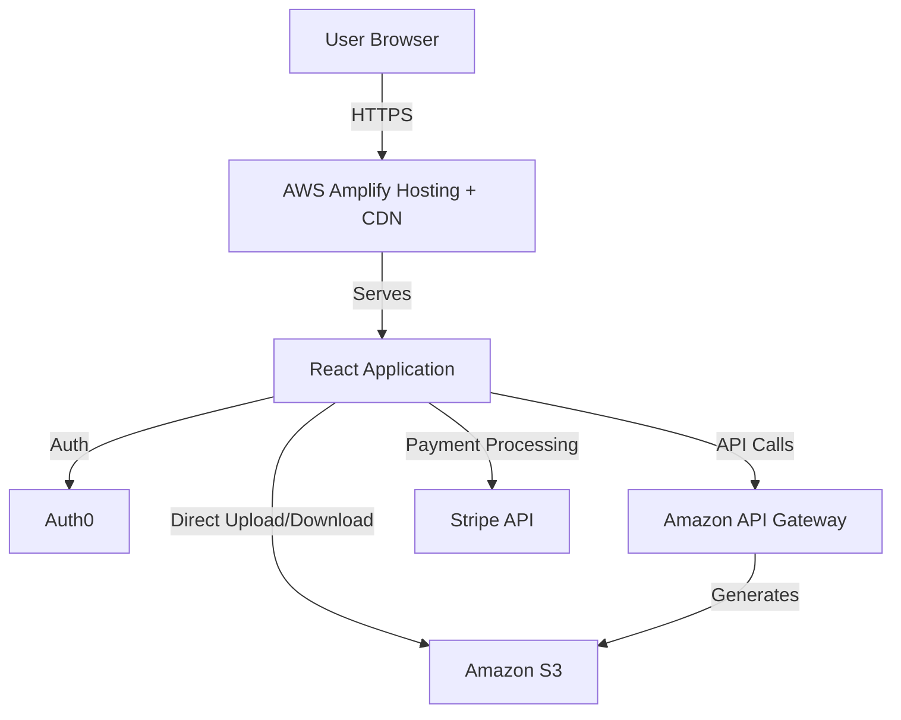

# Design Document

## Overview

The Customer Portal is a React-based single-page application (SPA) built with Vite and Refine framework that provides a comprehensive interface for customers to interact with the code analysis service. The application follows a modern frontend architecture with clear separation of concerns, utilizing AWS services for backend integration and Stripe for payment processing.

**Framework Stack:**
- **Refine**: Headless framework for CRUD operations, routing, and state management
- **Ant Design**: Enterprise UI component library for consistent, professional interface
- **Vite**: Build tool for fast development and optimized production builds
- **TypeScript**: Type-safe development with full IDE support

The design emphasizes security, performance, and user experience through:
- Token-based authentication with Auth0 (via Refine auth provider)
- Direct-to-S3 file uploads using pre-signed URLs
- Real-time status updates via polling (using Refine's data provider hooks)
- Optimized delivery through AWS Amplify Hosting with CDN
- Responsive UI with immediate feedback (Ant Design components)
- Automatic CRUD operations with minimal boilerplate (Refine hooks)

## Architecture

### High-Level Architecture



### Application Layers

1. **Presentation Layer**: Ant Design components with Refine hooks for data binding
2. **Refine Core Layer**: 
   - Data Provider: API Gateway integration for CRUD operations
   - Auth Provider: Amazon Cognito authentication integration
   - Router Provider: React Router v6 integration
   - Notification Provider: Ant Design notification system
3. **Service Layer**: Custom business logic for file uploads, polling, and Stripe integration
4. **Integration Layer**: AWS SDK, Stripe SDK, and HTTP clients

### Refine Architecture Benefits

**Automatic CRUD Operations:**
- `useTable`: Handles pagination, sorting, filtering for analysis dashboard
- `useForm`: Manages form state, validation, and submission for account/subscription forms
- `useShow`: Fetches and displays single resource details (analysis details, certificate info)
- `useCreate`, `useUpdate`, `useDelete`: Simplified resource mutations

**Built-in Features:**
- Automatic loading states and error handling
- Optimistic updates for better UX
- Request caching and invalidation
- Authentication state management
- Route-based access control

## Components and Interfaces

### 1. Authentication Module

**Refine Integration:**
- Implements Refine's `AuthProvider` interface for Auth0
- Automatic authentication state management
- Built-in route protection with `<Authenticated>` component
- Automatic token refresh and session handling

**Components:**
- `SignUpForm`: User registration using Ant Design Form + Auth0 Universal Login or custom signup
- `LoginForm`: User authentication using Ant Design Form + Refine `useLogin` hook
- `EmailVerification`: Confirmation code entry with Ant Design Input (if using custom flow)

**Auth Provider Implementation:**
```typescript
const authProvider: AuthProvider = {
  login: async ({ email, password }) => { /* Auth0 authentication */ },
  logout: async () => { /* Auth0 logout */ },
  check: async () => { /* Verify session */ },
  getPermissions: async () => { /* Get user permissions from Auth0 roles */ },
  getIdentity: async () => { /* Get current user from Auth0 */ },
  onError: async (error) => { /* Handle auth errors */ },
}
```

**Auth0 Integration:**
- `loginWithRedirect()`: Redirects to Auth0 Universal Login (recommended)
- `loginWithPopup()`: Opens Auth0 login in popup window
- `signupWithRedirect()`: Redirects to Auth0 signup page
- `logout()`: Ends user session and clears tokens
- `getUser()`: Retrieves current authenticated user profile
- `getAccessTokenSilently()`: Gets access token with automatic refresh
- `isAuthenticated()`: Checks if user is currently authenticated

**Auth0 SDK Integration:**
- Uses `@auth0/auth0-react` for React integration
- Provides `Auth0Provider` wrapper for the application
- Automatic token management and refresh
- Support for social login providers (Google, GitHub, etc.)
- Built-in MFA support

**State Management:**
- Managed automatically by Refine's auth provider and Auth0 SDK
- Authentication status (authenticated, unauthenticated, loading)
- Current user information via `useGetIdentity` hook
- Session tokens stored securely (httpOnly cookies or memory)

### 2. Account Management Module

**Refine Integration:**
- Uses `useForm` hook for form state management and validation
- Automatic form submission with loading states
- Built-in error handling and success notifications

**Components:**
- `AccountSettings`: Main account management page using Ant Design Layout
- `ProfileForm`: Edit user profile using Ant Design Form + Refine `useForm` hook
- `PasswordChangeForm`: Change password using Ant Design Form with validation
- `EmailVerification`: Handle email verification with Ant Design Input

**Ant Design Components Used:**
- `Form`: Form container with validation
- `Form.Item`: Individual form fields with labels and validation rules
- `Input`: Text input fields
- `Button`: Submit and action buttons
- `Card`: Content containers
- `notification`: Success/error feedback

**Data Operations:**
- `useGetIdentity()`: Fetches current user profile from Auth0
- `useUpdate()`: Updates user information with optimistic updates
- Auth0 Management API for profile updates, password changes, and email verification

### 3. Subscription and Payment Module

**Refine Integration:**
- Uses `useList` to fetch subscription plans
- Uses `useShow` to display current subscription details
- Uses `useCreate` and `useUpdate` for subscription operations
- Automatic loading states and error handling

**Components:**
- `SubscriptionPlans`: Display plans using Ant Design Card grid + Refine `useList` hook
- `PaymentForm`: Stripe Elements integrated with Ant Design Form
- `SubscriptionManager`: Manage subscription using Ant Design Descriptions + `useShow` hook
- `PaymentMethodManager`: Update payment methods with Ant Design Form + `useUpdate` hook

**Ant Design Components Used:**
- `Card`: Plan display cards
- `Descriptions`: Subscription details display
- `Form`: Payment and update forms
- `Modal`: Confirmation dialogs for cancellation
- `Badge`: Subscription status indicators
- `Button`: Action buttons
- `Divider`: Visual separation

**Data Operations:**
- `useList({ resource: "plans" })`: Retrieves available subscription plans
- `useShow({ resource: "subscriptions" })`: Fetches current subscription details
- `useCreate({ resource: "subscriptions" })`: Creates new subscription
- `useUpdate({ resource: "subscriptions" })`: Updates payment method
- `useDelete({ resource: "subscriptions" })`: Cancels subscription

**Integration:**
- Stripe Elements for secure payment input
- Stripe API for payment processing
- Backend API Gateway for subscription state management via Refine data provider

### 4. File Upload Module

**Refine Integration:**
- Uses `useCreate` to initiate upload and create analysis record
- Custom upload logic for S3 pre-signed URLs
- Automatic error handling and notifications

**Components:**
- `FileUploader`: Ant Design Upload component with drag-and-drop + custom S3 upload logic
- `UploadProgress`: Ant Design Progress component with real-time updates
- `FileValidator`: Client-side validation using Ant Design Form rules

**Ant Design Components Used:**
- `Upload.Dragger`: Drag-and-drop file upload interface
- `Progress`: Visual upload progress indicator
- `Alert`: Validation error messages
- `Button`: Upload action buttons
- `List`: Display uploaded files
- `Icon`: Upload, file, and status icons

**Data Operations:**
- `useCreate({ resource: "analyses" })`: Creates analysis record after upload
- Custom S3 upload logic:
  - Request pre-signed URL from API Gateway
  - Upload file directly to S3 with progress tracking
  - Notify backend of successful upload

**Validation:**
- File size limits (configurable, e.g., 100MB max)
- Supported file types (e.g., .zip, .tar.gz, .jar)
- File name sanitization
- Ant Design Upload `beforeUpload` hook for validation

### 5. Analysis Tracking Module

**Refine Integration:**
- Uses `useTable` for analysis list with automatic pagination and sorting
- Uses `useShow` for individual analysis details
- Uses `useList` with polling for real-time updates
- Automatic loading states and error handling

**Components:**
- `Dashboard`: Main dashboard using Ant Design Table + Refine `useTable` hook
- `AnalysisCard`: Individual analysis card using Ant Design Card
- `StatusIndicator`: Visual status using Ant Design Badge and Tag
- `AnalysisDetails`: Detailed view using Ant Design Descriptions + `useShow` hook

**Ant Design Components Used:**
- `Table`: Analysis list with sorting, filtering, pagination
- `Card`: Analysis summary cards
- `Badge`: Status indicators
- `Tag`: Status tags with colors
- `Progress`: Analysis progress bars
- `Descriptions`: Detailed analysis information
- `Timeline`: Analysis stage progression
- `Empty`: Empty state when no analyses exist

**Data Operations:**
- `useTable({ resource: "analyses" })`: Retrieves all user analyses with pagination
- `useShow({ resource: "analyses", id })`: Fetches specific analysis details
- `useList({ resource: "analyses", config: { polling: 5000 } })`: Real-time updates with polling
- Custom polling logic for active analyses only

**Status Polling:**
- Polling interval: 5 seconds for active analyses using Refine's polling feature
- Exponential backoff for completed analyses
- Automatic cache invalidation on status changes
- WebSocket consideration for future enhancement

### 6. Certificate Download Module

**Refine Integration:**
- Uses `useTable` or `useList` to fetch available certificates
- Uses `useShow` for certificate details
- Custom download logic for pre-signed URLs

**Components:**
- `CertificateList`: List using Ant Design Table or List + Refine `useTable` hook
- `DownloadButton`: Secure download using Ant Design Button with loading state
- `CertificatePreview`: Optional preview using Ant Design Modal

**Ant Design Components Used:**
- `Table` or `List`: Certificate list display
- `Button`: Download action buttons
- `Modal`: Certificate preview modal
- `Descriptions`: Certificate metadata display
- `Icon`: Download and file icons
- `Tooltip`: Additional information on hover

**Data Operations:**
- `useTable({ resource: "certificates" })`: Lists available certificates
- `useShow({ resource: "certificates", id })`: Fetches certificate details
- Custom download logic:
  - Request secure download URL from API Gateway
  - Initiate download with authorization validation
  - Handle download errors with retry mechanism

## Refine Configuration

### Core Setup

```typescript
import { Refine } from "@refinedev/core";
import { RefineKbar, RefineKbarProvider } from "@refinedev/kbar";
import routerBindings from "@refinedev/react-router-v6";
import { BrowserRouter } from "react-router-dom";
import { ConfigProvider } from "antd";
import { AntdApp, ThemedLayoutV2, useNotificationProvider } from "@refinedev/antd";

import { authProvider } from "./providers/authProvider";
import { dataProvider } from "./providers/dataProvider";

function App() {
  return (
    <BrowserRouter>
      <RefineKbarProvider>
        <ConfigProvider theme={/* Ant Design theme */}>
          <AntdApp>
            <Refine
              authProvider={authProvider}
              dataProvider={dataProvider}
              routerProvider={routerBindings}
              notificationProvider={useNotificationProvider}
              resources={[
                { name: "analyses", list: "/analyses", show: "/analyses/:id" },
                { name: "certificates", list: "/certificates" },
                { name: "subscriptions", show: "/subscription" },
              ]}
              options={{
                syncWithLocation: true,
                warnWhenUnsavedChanges: true,
              }}
            >
              <ThemedLayoutV2>
                {/* Routes */}
              </ThemedLayoutV2>
              <RefineKbar />
            </Refine>
          </AntdApp>
        </ConfigProvider>
      </RefineKbarProvider>
    </BrowserRouter>
  );
}
```

### Data Provider (API Gateway Integration)

```typescript
import { DataProvider } from "@refinedev/core";
import axios from "axios";

export const dataProvider: DataProvider = {
  getList: async ({ resource, pagination, filters, sorters }) => {
    // API Gateway REST API calls
    const response = await axios.get(`${API_URL}/${resource}`, {
      params: { /* pagination, filters, sorters */ }
    });
    return {
      data: response.data.items,
      total: response.data.total,
    };
  },
  getOne: async ({ resource, id }) => {
    const response = await axios.get(`${API_URL}/${resource}/${id}`);
    return { data: response.data };
  },
  create: async ({ resource, variables }) => {
    const response = await axios.post(`${API_URL}/${resource}`, variables);
    return { data: response.data };
  },
  update: async ({ resource, id, variables }) => {
    const response = await axios.put(`${API_URL}/${resource}/${id}`, variables);
    return { data: response.data };
  },
  deleteOne: async ({ resource, id }) => {
    const response = await axios.delete(`${API_URL}/${resource}/${id}`);
    return { data: response.data };
  },
  getApiUrl: () => API_URL,
};
```

### Auth Provider (Auth0 Integration)

```typescript
import { AuthProvider } from "@refinedev/core";
import { Auth0Client } from "@auth0/auth0-spa-js";

const auth0Client = new Auth0Client({
  domain: process.env.VITE_AUTH0_DOMAIN!,
  clientId: process.env.VITE_AUTH0_CLIENT_ID!,
  authorizationParams: {
    redirect_uri: window.location.origin,
    audience: process.env.VITE_AUTH0_AUDIENCE,
  },
});

export const authProvider: AuthProvider = {
  login: async ({ email, password }) => {
    // Auth0 authentication logic (redirect or popup)
    await auth0Client.loginWithRedirect({
      authorizationParams: {
        login_hint: email,
      },
    });
    return { success: true };
  },
  logout: async () => {
    // Auth0 logout
    await auth0Client.logout({
      logoutParams: {
        returnTo: window.location.origin,
      },
    });
    return { success: true };
  },
  check: async () => {
    // Verify current session
    const isAuthenticated = await auth0Client.isAuthenticated();
    return { authenticated: isAuthenticated };
  },
  getPermissions: async () => {
    // Get user permissions from Auth0 roles/permissions
    const user = await auth0Client.getUser();
    return user?.["https://your-app.com/roles"] || [];
  },
  getIdentity: async () => {
    // Get current user information
    const user = await auth0Client.getUser();
    return {
      id: user?.sub,
      name: user?.name,
      email: user?.email,
      avatar: user?.picture,
    };
  },
  onError: async (error) => {
    // Handle authentication errors
    return { error };
  },
};
```

## Data Models

### User Model
```typescript
interface User {
  id: string;
  email: string;
  emailVerified: boolean;
  firstName: string;
  lastName: string;
  createdAt: Date;
  updatedAt: Date;
}
```

### Subscription Model
```typescript
interface Subscription {
  id: string;
  userId: string;
  planId: string;
  planName: string;
  status: 'active' | 'canceled' | 'past_due' | 'trialing';
  currentPeriodStart: Date;
  currentPeriodEnd: Date;
  cancelAtPeriodEnd: boolean;
  amount: number;
  currency: string;
}
```

### Analysis Model
```typescript
interface Analysis {
  id: string;
  userId: string;
  fileName: string;
  fileSize: number;
  status: 'uploading' | 'queued' | 'processing' | 'completed' | 'failed';
  progress: number; // 0-100
  submittedAt: Date;
  completedAt?: Date;
  errorMessage?: string;
  certificateId?: string;
}
```

### Certificate Model
```typescript
interface Certificate {
  id: string;
  analysisId: string;
  userId: string;
  fileName: string;
  generatedAt: Date;
  expiresAt?: Date;
  downloadUrl?: string; // Temporary, pre-signed URL
}
```

### Authentication Tokens
```typescript
interface AuthTokens {
  accessToken: string;
  idToken: string;
  refreshToken: string;
  expiresAt: Date;
}
```

## Error Handling

### Error Categories

1. **Authentication Errors**
   - Invalid credentials
   - Expired session
   - Unverified email
   - Account locked

2. **Validation Errors**
   - Invalid input format
   - File size exceeded
   - Unsupported file type
   - Missing required fields

3. **Network Errors**
   - Connection timeout
   - API unavailable
   - Upload interrupted
   - Download failed

4. **Business Logic Errors**
   - Subscription required
   - Subscription expired
   - Insufficient permissions
   - Resource not found

### Error Handling Strategy

**User-Facing Errors:**
- Display clear, actionable error messages
- Provide retry mechanisms for transient failures
- Show inline validation errors in forms
- Use toast notifications for non-blocking errors

**Technical Errors:**
- Log errors to console in development
- Send error reports to monitoring service in production
- Include request IDs for debugging
- Implement error boundaries for React component failures

**Retry Logic:**
- Automatic retry for network failures (max 3 attempts with exponential backoff)
- Manual retry button for user-initiated actions
- Queue failed uploads for retry when connection restored

## Testing Strategy

### Unit Testing
- Test individual components in isolation
- Mock external dependencies (API calls, AWS SDK)
- Test service layer business logic
- Validate data transformations and utilities
- Target: 80% code coverage for critical paths

### Integration Testing
- Test component interactions
- Test authentication flows end-to-end
- Test file upload workflow with mocked S3
- Test subscription management with mocked Stripe
- Verify state management across modules

### End-to-End Testing
- Test complete user journeys (signup → subscribe → upload → download)
- Test authentication persistence across page refreshes
- Test error scenarios and recovery
- Test responsive design on multiple devices
- Use Cypress or Playwright for automation

### Performance Testing
- Measure initial load time
- Test with large file uploads
- Verify polling doesn't degrade performance
- Test with slow network conditions
- Monitor bundle size and code splitting effectiveness

### Security Testing
- Verify HTTPS enforcement
- Test token storage security
- Validate authorization checks
- Test session expiration handling
- Verify pre-signed URL expiration

## Performance Optimization

### Code Splitting
- Route-based code splitting for each major module
- Lazy load heavy components (file uploader, payment forms, Stripe Elements)
- Separate vendor bundles for stable dependencies
- Lazy load Ant Design components using dynamic imports
- Split Refine providers and hooks by feature

### Ant Design Optimization
- Use Ant Design's tree-shaking capabilities (import specific components)
- Configure Vite to optimize Ant Design bundle size
- Use Ant Design's `ConfigProvider` for theme customization (avoid CSS overrides)
- Lazy load Ant Design icons
- Consider using `antd-dayjs-webpack-plugin` alternative for Vite to reduce moment.js size

### Refine Optimization
- Use Refine's built-in caching to reduce API calls
- Configure appropriate cache TTL for different resources
- Implement optimistic updates for better perceived performance
- Use Refine's `useInfiniteList` for large datasets instead of pagination

### Caching Strategy
- Cache static assets with long TTL via CDN
- Cache API responses with appropriate TTL (managed by Refine)
- Implement optimistic UI updates (built-in with Refine)
- Use service worker for offline capability (future enhancement)

### Bundle Optimization
- Tree shaking for unused code elimination
- Minification and compression
- Image optimization and lazy loading
- Font subsetting and preloading
- Target bundle size: <500KB initial load (Ant Design ~300KB, Refine ~100KB, app code ~100KB)

## Security Considerations

### Authentication Security
- Store tokens in memory or httpOnly cookies (not localStorage)
- Implement automatic token refresh
- Clear all auth state on logout
- Implement CSRF protection for state-changing operations

### Data Security
- All API calls over HTTPS
- Validate and sanitize all user inputs
- Implement Content Security Policy (CSP)
- Use pre-signed URLs with short expiration (5-15 minutes)
- Never expose AWS credentials in frontend code

### Authorization
- Verify user permissions before displaying sensitive data
- Implement route guards for protected pages
- Validate user ownership of resources (analyses, certificates)
- Handle authorization errors gracefully

## Deployment Architecture

### AWS Amplify Hosting
- Automatic CI/CD from Git repository
- Preview deployments for pull requests
- Custom domain with SSL certificate
- Global CDN for optimized delivery
- Environment-specific configurations

### Environment Configuration
- Development: Local development with mock services
- Staging: Full AWS integration for testing
- Production: Optimized build with monitoring

### Configuration Management
- Environment variables for API endpoints
- Feature flags for gradual rollouts
- Separate AWS resources per environment
- Stripe test mode for non-production environments
